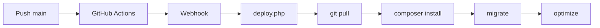

# 📚 Hotel PMS — Tutorial & Dokumentasi

**Versi:** 2.3 | **Update:** Juni 2026 | **Stack:** Laravel 13 / PHP 8.3 / MySQL / Blade + Tailwind

---

## 📑 Daftar Isi
1. [Pendahuluan & Prasyarat](#-pendahuluan)
2. [Login & Test Credentials](#-login)
3. [Learning Path](#-learning-path)
4. [Navigasi Menu](#-navigasi-menu)
5. [Quick Start — Instalasi](#-quick-start)
6. [Fitur Step-by-Step](#fitur-step-by-step)
7. [Permission & Role](#-permission--role)
8. [Model, API & Struktur Project](#-model--api--struktur)
9. [Troubleshooting](#-troubleshooting)
10. [Glossary](#-glossary)
11. [Latihan Mandiri](#-latihan-mandiri)
12. [Deployment & Support](#-deployment--support)

---

## 🎯 Pendahuluan

**Hotel PMS** — Aplikasi manajemen hotel berbasis web: room dashboard, reservasi, check-in/out, housekeeping, keuangan (deposit, other revenue, resto, expense), OTA email integration, AI Chat, Night Audit, laporan lengkap, & manajemen role/permission.

**Prasyarat:** PHP 8.3+, Composer, Node.js/NPM, MySQL, Git, Web Browser.  
💡 Pakai Laragon? Semua sudah include — download di [laragon.org](https://laragon.org).

---

## 🔑 Login

| Username | Password | Role | Akses |
|----------|----------|------|-------|
| `owner` | `password` | Owner | **Semua fitur** + admin panel penuh |
| `admin` | `password` | Admin | Semua kecuali settings sensitif & owner-only |
| `frontoffice` | `password` | Front Office | Reservasi, check-in/out, HK, transaksi, resto |

**Cara:** Buka `http://localhost:8000` → Login → isi username/password → **Login**.

> 🧪 **Latihan 1:** Login dengan 3 akun, amati perbedaan menu!

---

## 🗺️ Learning Path

| Level | Waktu | Topik |
|-------|-------|-------|
| 🟢 **Pemula** | 1-2 jam | Login, Room Dashboard, Room Rack, Booking, Check-in/out |
| 🟡 **Menengah** | 3-5 jam | Deposit, Other Revenue, Housekeeping, Pendapatan Resto, Reports |
| 🔵 **Mahir** | 5-8 jam | OTA Email Log, Night Audit v2, Promo Pricing, AI Chat, Expenses |
| ⚫ **Expert** | 8+ jam | API Eksternal, Role & Permission, Backup, API Keys, Deployment |

---

## 🧭 Navigasi Menu

```
📋 Sidebar
├── 🏠 Dashboard              → Owner/Admin dashboard (statistik global)
├── 📅 Reservasi               → Semua reservasi
├── 🛎️ Front Desk
│   ├── Check-in               → Proses check-in tamu
│   ├── Checkout               → Proses check-out tamu + Due Out
│   ├── Pindah Kamar           → Room change
│   ├── Issue Card             → MHS card issuer
│   ├── Deposit Kartu          → Deposit/return uang jaminan
│   └── Other Revenue         → Pendapatan lain (laundry, minibar, dll)
├── 📊 Availability
│   ├── Room Rack              → Traditional rack view
│   └── Occupancy Calendar     → Kalender okupansi
├── 📅 Booking
│   ├── Booking Single         → Reservasi 1 kamar
│   ├── Booking OTA            → Reservasi dari platform OTA
│   └── Booking Group          → Reservasi rombongan
├── 🛏️ Room Management
│   ├── Room List              → Daftar semua kamar
│   ├── Rooms                  → CRUD kamar
│   ├── Room Types             → Tipe kamar & harga
│   └── Promo Harga            → Harga promo per tanggal
├── 🧹 Housekeeping
│   ├── Dashboard              → Semua tugas + statistik
│   ├── Tugas Saya             → Tugas staff yg sedang login
│   ├── Ambil Tugas            → Self-assign kamar cleaning
│   ├── Print Room List        → Cetak daftar kamar
│   └── Lost & Found           → Barang hilang ditemukan
├── 👥 Guest Management        → Database tamu
├── 🍽️ Pendapatan Resto        → Transaksi restoran
├── 🌙 Night Audit v2          → Preview → Draft → Lock
├── 💸 Pengeluaran             → Catat biaya operasional
├── 📊 Reports
│   ├── Night Audit            → Laporan audit harian
│   ├── Guest List Report      → Laporan daftar tamu
│   ├── Occupancy              → Laporan okupansi
│   ├── Revenue                → Laporan pendapatan
│   ├── Reservation Report     → Laporan reservasi
│   ├── Group Report           → Laporan grup
│   ├── Laporan Pengeluaran    → Laporan biaya
│   ├── Log Email OTA          → Email dari Tiket/Traveloka
│   └── Laporan Bulanan Hotel  → Compliance report
├── ⚙️ Administration          (Owner/Admin)
│   ├── Permission Dashboard   → Overview hak akses
│   ├── Permissions            → Daftar permission
│   ├── User Permissions       → Atur permission per user
│   ├── Manage Users           → CRUD user
│   ├── Backup Database        → Backup & restore
│   ├── API Keys               → Generate/revoke API key
│   └── TV Welcome Settings    → Setting TV lobby
├── 🗂️ Master Data             (Owner/Admin)
│   └── Metode Pembayaran      → CRUD payment method
├── ⚙️ Setting Hotel           → Konfigurasi hotel
└── 📖 Tutorial                → Panduan ini
```

> Menu tergantung **Role** Anda. Login sebagai `owner` untuk akses penuh.

---

## 🚀 Quick Start

```bash
# 1. Clone & install
git clone https://github.com/imamw95-crb/hotel-pms.git && cd hotel-pms
composer install && npm install

# 2. Setup env
cp .env.example .env
php artisan key:generate

# 3. Setup DB (edit .env: DB_DATABASE=hotel_pms, DB_USERNAME=root, DB_PASSWORD=)
php artisan migrate && php artisan db:seed

# 4. Jalankan (2 terminal)
php artisan serve    # Terminal 1
npm run dev          # Terminal 2
```

Buka `http://localhost:8000` — login `owner` / `password`.

**Konfigurasi Tambahan (.env):**
```env
OPENROUTER_API_KEY=sk-or-v1-xxx       # AI Chat
IMAP_HOST=imap.hostinger.com          # OTA Email
IMAP_USERNAME=info@theicon.id
IMAP_PASSWORD=xxx
DEPLOY_SECRET=xxx
MHS_BRIDGE_URL=http://100.98.230.92/bridge_api.php
```

---

## Fitur Step-by-Step

### 1. 📅 Room Dashboard

Halaman utama setelah login. Menampilkan **grid semua kamar** dengan warna status real-time.

**Status Kamar:**
- 🟢 **Available** — Kamar kosong & siap dipesan
- 🔴 **Occupied** — Kamar ditempati tamu
- 🟡 **Cleaning / Dirty** — Kamar sedang dibersihkan
- ⚪ **Maintenance** — Kamar dalam perbaikan

**Fitur:**
- Ringkasan statistik: Available, Occupied, Check-in/out hari ini, Dirty, Maintenance, Okupansi (%)
- Klik kamar **Available** → langsung buka modal booking
- **Bulk Update Status** — Pilih banyak kamar → ubah status massal (misal: cleaning → available)
- **Filter** — Cari berdasarkan no. kamar atau tipe kamar

> 🧪 **Latihan 2:** Login sebagai `owner`, catat jumlah kamar occupied & available hari ini.

---

### 2. 📊 Room Rack & Availability

**Akses:** Sidebar → Availability

Tiga tampilan untuk cek ketersediaan kamar:
1. **Grid Kamar** — Tampilan grid warna status (sama seperti Dashboard)
2. **Room Rack** — Tampilan rack tradisional per lantai/tipe kamar — cocok untuk cek availability harian
3. **Forecast** — Prediksi ketersediaan kamar ke depan — membantu perencanaan okupansi

**Occupancy Calendar** — Kalender okupansi harian untuk melihat tren tingkat hunian.

---

### 3. 📅 Booking / Reservasi

#### A. Booking Single
1. Pilih tanggal **Check-in** (min 14:00) dan **Check-out** (min 12:00)
2. Sistem otomatis menampilkan kamar tersedia (tanpa overlap)
3. Pilih kamar → Isi data tamu (Nama, No. Identitas, Telepon, Alamat, Email)
4. Atur **Harga per Malam** — otomatis terisi harga weekday/weekend, bisa diubah manual
5. Centang **Include Breakfast** jika termasuk sarapan
6. Isi **DP (Down Payment)** — nominal uang muka
7. Pilih **Metode Pembayaran** — Tunai, Transfer Bank, QRIS, atau Debit/Kredit Card
8. Klik **Simpan**

> 💡 **Back-to-Back:** Check-out 12:00 & check-in 14:00 di kamar sama = ✅ **DIPERBOLEHKAN**

#### B. Booking OTA
Untuk reservasi manual dari platform OTA (Booking.com, Tiket.com, Traveloka).
1. Pilih **Platform OTA**
2. Masukkan **No. Reservasi OTA**
3. Isi data tamu & detail reservasi seperti booking biasa
4. Sistem otomatis menandai reservasi sebagai **OTA**

#### C. Booking Group
Untuk reservasi beberapa kamar sekaligus (rombongan, wedding, dll).
1. Masukkan **Nama Grup** (contoh: "Rombongan Wedding")
2. Pilih tanggal Check-in dan Check-out
3. Untuk setiap kamar: pilih kamar, isi data tamu, atur harga
4. Klik **Simpan**

> 🧪 **Latihan 3:** Buat booking Single untuk "Budi Santoso" Standard Room 2 malam dengan DP 50%.

---

### 4. ✅ Check-in & Check-out

#### Check-in
1. Buka **Front Desk → Check-in**
2. Filter berdasarkan nama, no. reservasi, kamar, atau rentang tanggal
3. Klik tombol **Check-in** pada reservasi status `pending`
4. Sistem otomatis: status reservasi → `checked_in`, status kamar → **Occupied**

#### Check-out
1. Buka **Front Desk → Checkout**
2. Daftar kamar **Occupied**. Kamar **Due Out** (jadwal check-out hari ini) disorot merah
3. Verifikasi tagihan tamu — klik **Detail** untuk lihat rincian
4. Pastikan semua **Other Revenue** & **Deposit** sudah terproses
5. Klik **Checkout** → konfirmasi
6. Status kamar → **Available**, tugas housekeeping otomatis terbuat

> 🧪 **Latihan 4:** Check-in reservasi dari latihan 3, lalu check-out. Amati perubahan status kamar.

---

### 5. 📋 Detail Reservasi

**Akses:** Klik nomor reservasi di daftar Reservasi.

**Informasi lengkap satu reservasi:**
- **Info Tamu** — Nama, No. Identitas, Telepon, Email
- **Info Kamar** — No. Kamar, Tipe, Check-in/out, Status Sarapan (bisa toggle langsung ✅)
- **Keuangan** — Total tagihan (bisa update), room rate (bisa update), riwayat pembayaran (bisa tambah)
- **Info OTA** — Jika dari Booking.com/Tiket.com/Traveloka, tampil nomor reservasi OTA & status bayar
- **Aksi:** Cetak Kwitansi 🖨️, Cetak Invoice 🖨️, Batalkan Reservasi ❌, Check-in/out

**Fitur pada halaman detail:**
- **Toggle Breakfast** — Klik toggle untuk menambah/hapus sarapan (harga otomatis menyesuaikan)
- **Update Total** — Ubah total tagihan manual
- **Update Room Rate** — Ubah harga per malam (total menyesuaikan otomatis)
- **Tambah Pembayaran** — Catat pembayaran tambahan (DP atau pelunasan)
- **Print Kwitansi** — Cetak tanda terima pembayaran
- **Print Invoice** — Cetak tagihan lengkap

---

### 6. 🔄 Pindah Kamar (Room Change)

1. Buka **Front Desk → Pindah Kamar**
2. Pilih reservasi **Checked In** yang akan dipindah
3. Pilih kamar baru yang tersedia (disarankan tipe yang sama)
4. Masukkan alasan pemindahan (opsional)
5. Klik **Pindahkan**

---

### 7. 💳 Issue Card MHS

**Akses:** Front Desk → Issue Card

Menerbitkan kartu akses kamar melalui perangkat **MHS (Magic Hotel System)**.
1. Cari reservasi (berdasarkan no. reservasi, nama tamu, atau no. kamar)
2. Atur **jumlah kartu** (default 1)
3. Klik **Issue Card**

**Fitur tambahan:**
- 🔄 **Re-Issue** — Untuk kartu hilang/rusak
- 🔌 **Test Connection** — Uji koneksi ke perangkat MHS
- 👁️ **Read Card** — Baca data kartu yang sudah diterbitkan

---

### 8. 💰 Deposit Kartu

**Akses:** Front Desk → Deposit Kartu

Mengelola deposit/uang jaminan kartu tamu (nominal default Rp 100.000/kartu).

**Alur:**
1. **Saat check-in** — catat deposit via **Tambah Deposit**
2. **Saat check-out** — lakukan **Return Deposit** untuk mengembalikan uang jaminan

Filter berdasarkan tanggal atau cari no. receipt / nama tamu.

> 🧪 **Latihan 5:** Buat deposit Rp 100.000 untuk reservasi check-in, lalu return deposit.

---

### 9. 🧾 Other Revenue

**Akses:** Front Desk → Other Revenue

Mencatat pendapatan lain selain kamar dan resto (minibar, laundry, telepon, snack, dll).
1. Pilih reservasi tujuan
2. Masukkan deskripsi biaya dan nominal
3. Simpan — total biaya otomatis masuk ke tagihan reservasi

> 🧪 **Latihan 6:** Tambah other revenue laundry Rp 75.000 ke reservasi check-in.

---

### 10. 🍽️ Pendapatan Resto

**Akses:** Sidebar → Pendapatan Resto

Mencatat transaksi restoran hotel. Bisa dikaitkan ke tagihan kamar tamu.
- **Tambah Transaksi** — catat penjualan makanan/minuman
- Filter berdasarkan periode tanggal
- Transaksi bisa ditambahkan ke tagihan kamar tamu tertentu

---

### 11. 🧹 Housekeeping

**Akses:** Sidebar → Housekeeping

Manajemen tugas pembersihan dan perawatan kamar.

**Dashboard Housekeeping:**
- Statistik: Menunggu, Sedang Dikerjakan, Selesai Hari Ini, Urgent
- Filter by status/tipe/prioritas/kamar/tanggal
- Tugas **overdue** = badge merah

**Buat Tugas:**
1. Pilih kamar → Tipe (`cleaning`/`deep_clean`/`maintenance`/`inspection`/`turndown`)
2. Prioritas (`low`/`normal`/`high`/`urgent`)
3. Deskripsi → Assign staff → **Simpan**

**Bulk Create:** Buat tugas untuk banyak kamar sekaligus.

**Assign:**
- **Manual** (👤) — Pilih staff langsung
- **Auto-Assign** (✨) — Otomatis ke staff dengan beban paling ringan

**Kerjakan Tugas:**
1. ▶️ **(Mulai)** — timer berjalan
2. ✅ **(Selesai)** — upload foto, isi checklist → durasi tercatat
3. Riwayat log tercatat otomatis

**Menu Lain:**
- **Tugas Saya** — Tugas yang diassign ke staff yang sedang login
- **Ambil Tugas** — Self-assign kamar yang perlu dibersihkan
- **Room Tasks** — Semua tugas per kamar
- **Room History** — Riwayat housekeeping per kamar
- **Print** — Cetak laporan housekeeping

> 🧪 **Latihan 7:** Buat 3 tugas cleaning, assign ke staff berbeda, selesaikan 1, amati statistik.

---

### 12. 💸 Pengeluaran (Expenses)

**Akses:** Sidebar → Pengeluaran

Mencatat biaya operasional hotel (listrik, air, gaji, supplies, dll).
- **Tambah Pengeluaran** — Kategori, deskripsi, nominal, tanggal
- Filter berdasarkan periode tanggal
- Data otomatis masuk ke **Laporan Pengeluaran** di Reports

---

### 13. 📊 Laporan (Reports)

| Laporan | Akses | Export |
|---------|-------|--------|
| Night Audit | Reports → Night Audit | CSV / Print |
| Guest List | Reports → Guest List Report | CSV / Print |
| Occupancy | Reports → Occupancy | CSV / Print |
| Revenue | Reports → Revenue | CSV / Print |
| Reservation Report | Reports → Reservation Report | CSV / Print |
| Group Report | Reports → Group Report | CSV / Print |
| Laporan Pengeluaran | Reports → Laporan Pengeluaran | CSV / Print |
| Log Email OTA | Reports → Log Email OTA | — |
| Laporan Bulanan Hotel | Reports → Laporan Bulanan Hotel | CSV / Print |

> 🧪 **Latihan 8:** Buka Occupancy bulan ini, export CSV, buka di Excel.

---

### 14. 🌙 Night Audit v2

**Akses:** Sidebar → Night Audit v2

Sistem penutupan akhir hari dengan workflow:
1. **Preview** — Lihat pratinjau data audit (occupied, check-in/out hari ini, pendapatan)
2. **Save Draft** — Simpan sebagai draft (masih bisa diedit)
3. **Lock** — Kunci data final (tidak bisa diubah lagi)
4. **History** — Lihat laporan night audit sebelumnya
5. **Export** — Download file laporan

> 💡 Lakukan **setiap malam** untuk menjaga akurasi data keuangan.

---

### 15. 🎫 Promo Harga

**Akses:** Room Management → Promo Harga

Menetapkan **harga khusus (promo)** per tanggal untuk setiap Tipe Kamar.

**Cara Kerja:**
- Promo berlaku per **Tipe Kamar**, bukan per kamar individu
- Setiap promo memiliki **label** (misal: "Promo Lebaran")
- Bisa input **range tanggal** — otomatis create untuk setiap tanggal
- Jika sudah ada promo di tanggal sama, akan **diupdate**

**Prioritas Harga:**
1. 🥇 Harga Promo
2. 🥈 Harga Weekend
3. 🥉 Harga Weekday
4. Default (price_per_night)

**Cara Menggunakan:**
1. Buka **Room Management → Promo Harga**
2. Klik **+ Tambah Promo**
3. Pilih **Tipe Kamar**
4. Isi **Dari Tanggal** dan **Sampai Tanggal** (kosongkan jika 1 hari)
5. Masukkan **Harga Promo** per malam
6. Isi **Label Promo**
7. Klik **Simpan Promo**

> 🧪 **Latihan 9:** Buat promo Deluxe diskon 20% selama 3 hari, verifikasi harga di booking.

---

### 16. 🔍 Lost & Found

**Akses:** Housekeeping → Lost & Found

**Tambah Item:** Nama, kategori, deskripsi, lokasi, penemu → **Simpan**.

**Status Workflow:**
`reported` ➡️ `found` ➡️ `returned` ➡️ `disposed`

> 🧪 **Latihan 10:** Catat "Dompet Hitam" ditemukan di kamar 102, update ke `returned`.

---

### 17. 👥 Manajemen Tamu (Guest Management)

**Akses:** Sidebar → Guest Management

Database semua tamu yang pernah menginap.
- Cari tamu berdasarkan **nama, telepon, email, atau no. identitas**
- **Tambah tamu** baru
- **Edit data** tamu yang sudah ada
- **Export CSV** — download data semua tamu

---

### 18. 🛏️ Kamar & Tipe Kamar

| Menu | Fungsi |
|------|--------|
| **Room List** | Daftar semua kamar dengan informasi lengkap. Bisa di-print. |
| **Rooms** | Tambah/edit/hapus kamar. Atur: no. kamar, tipe, harga, fasilitas, status. |
| **Room Types** | Atur tipe kamar: nama tipe, harga weekday & weekend, kapasitas, fasilitas. |

---

### 19. 📧 OTA Email Log

**Akses:** Reports → Log Email OTA

Memantau dan mengelola email reservasi dari platform OTA (Booking.com, Tiket.com, Traveloka).

**Fitur:**
- **Statistik** — Total, Diproses, Sukses, Gagal, Pending
- **Daftar Email** — Tabel dengan status, platform, subjek, tanggal
- **Detail Email** — Klik untuk lihat isi lengkap & data parsing
- **Retry** — Coba ulang proses parsing untuk email yang gagal
- Filter berdasarkan **Platform OTA** dan **Status**
- Pencarian berdasarkan **subjek email** atau **nomor reservasi**

> 💡 Pastikan IMAP dikonfigurasi di **Setting Hotel**.
> 🧪 **Latihan 11:** Cek OTA Email Log, retry email yang gagal.

---

### 20. 🤖 AI Chat Assistant

**Akses:** Klik tombol **🤖 AI** di pojok kanan bawah halaman Reservasi.

Asisten AI untuk membantu operasional front office.

**Contoh perintah:**
- *"Cari kamar deluxe tersedia 3 malam mulai besok"*
- *"Booking deluxe 102 untuk 2 malam atas nama Budi Santoso"*
- *"Cari reservasi a.n. Siti"*
- *"Kamar apa saja yang available untuk 3-5 Juni?"*

> 💡 Pastikan `OPENROUTER_API_KEY` di .env sudah terisi.

---

### 21. ⚙️ Administrasi (Owner Only)

#### Permission Management
- **Permission Dashboard** — Overview semua permission & role
- **Permissions** — Daftar semua permission yang tersedia
- **User Permissions** — Atur permission spesifik per user (override role)

#### Manage Users
- Tambah/edit/hapus user
- Atur role dan permission tambahan per user

#### Backup Database
- **Create Backup** — Buat backup baru
- ⬇️ **Download** — Download file backup
- **Restore** — Kembalikan database dari backup
- ❌ **Hapus** — Hapus backup lama
- ⚠️ Backup **setiap hari**, simpan di **2 tempat**, backup **sebelum update besar**

#### API Keys
- **Generate** — Buat API Key baru
- Pilih user owner/admin sebagai pemilik key
- **Revoke** — Hapus key yang tidak digunakan
- ⚠️ Key hanya ditampilkan **sekali** saat generate

#### Metode Pembayaran (Master Data)
- Atur metode pembayaran: Tunai, Transfer Bank, QRIS, Debit/Kredit Card

#### TV Welcome Settings
Atur tampilan **TV Welcome Screen** untuk lobby/room TV:
- Welcome message
- Nama hotel
- Background/image

#### Setting Hotel
Konfigurasi: nama hotel, alamat, telepon, logo, IMAP, OpenRouter key, MHS Bridge URL.

> 🧪 **Latihan 12:** Login owner → buka semua menu Admin, jelajahi fitur Permission & Backup.

---

### 22. 📺 TV Welcome Screen

**URL Publik (tanpa login):**
```
GET /tv/{room}           → Welcome screen for room
GET /tv/{room}/status    → Status kamar (JSON)
```

Cocok untuk ditampilkan di TV lobby atau smart TV kamar.

---

### 23. 🔔 Notifikasi

**Akses:** Ikon lonceng 🔔 di pojok kanan atas (setelah login).

- Daftar notifikasi real-time
- **Mark as Read** — Tandai satu notifikasi
- **Mark All as Read** — Tandai semua sudah dibaca
- Notifikasi OTA & housekeeping muncul otomatis

---

## 🔐 Permission & Role

| Role | Level | Akses |
|------|-------|-------|
| `owner` | ⭐⭐⭐⭐⭐ | Semua fitur termasuk admin panel |
| `admin` | ⭐⭐⭐⭐ | Semua kecuali owner-only settings |
| `frontoffice` | ⭐⭐⭐ | Operasional harian (front desk) |
| `user_manager` | ⭐⭐⭐ | Kelola user (tanpa admin panel) |

**Kelola User:** Admin → Manage Users → Tambah/Edit → Atur Role.

**Kelola Permission:**
- **Per Role:** Admin → Permissions → Pilih Role → Centang permission → Simpan
- **Per User:** Admin → User Permissions → Pilih User → Atur permission tambahan

```blade
{{-- Blade directives --}}
@if(hasPermission('view_reports')) ... @endif
@if(hasAllPermissions(['view_reports','export_reports'])) ... @endif
@if(hasAnyPermission(['manage_users','manage_rooms'])) ... @endif
```

```php
// Route middleware
Route::get('/reports', ...)->middleware('permission:view_reports');
Route::group(['middleware' => ['role:owner']], function () { ... });
```

> 🧪 **Latihan 13:** Login owner → Admin → Permissions → edit permission frontoffice, lalu cek perubahannya.

---

## 📊 Model, API & Struktur

### Core Models

| Model | Tabel | Relasi |
|-------|-------|--------|
| Room | rooms | → RoomType, hasMany Reservation |
| RoomType | room_types | hasMany Room, hasMany RoomTypeDatePrice |
| Reservation | reservations | → Room, Guest, User |
| Guest | guests | hasMany Reservation |
| Transaction | transactions | → Reservation, PaymentMethod |
| User | users | → Role |
| Role | roles | hasMany User, belongsToMany Permission |
| Permission | permissions | belongsToMany Role |
| HousekeepingTask | housekeeping_tasks | → Room, User |
| HousekeepingTaskChecklist | housekeeping_task_checklists | → HousekeepingTask |
| HousekeepingTaskLog | housekeeping_task_logs | → HousekeepingTask |
| HousekeepingInventory | housekeeping_inventories | — |
| Deposit | deposits | → Reservation |
| ServiceCharge | service_charges | → Reservation |
| Expense | expenses | — |
| RestoTransaction | resto_transactions | → Reservation (opsional) |
| BookingNotification | booking_notifications | morphTo |
| NightAuditLog | night_audit_logs | — |
| LostFound | lost_founds | → Reservation (opsional) |
| HotelSetting | hotel_settings | — |
| PaymentMethod | payment_methods | hasMany Transaction |
| RoomTypeDatePrice | room_type_date_prices | → RoomType |
| MHSLog | m_h_s_logs | — |
| ProcessedEmail | processed_emails | — |

### Business Logic Penting
- **Check-in:** 14:00 | **Check-out:** 12:00
- **Back-to-back:** CI 14:00 setelah CO 12:00 di kamar sama = ✅ **AMAN**
- **Overlap query:** `where('check_in', '<', $checkOut)->where('check_out', '>', $checkIn)` (strict, NOT inclusive)
- **Room status:** `available` 🟢 → `occupied` 🔴 → `cleaning` 🟡 → `maintenance` ⚫
- **Reservation status:** `pending` → `checked_in` → `checked_out` / `cancelled`
- **Due Out** = room `occupied` tapi jadwal check-out hari ini

### Services

| Service | Fungsi |
|---------|--------|
| AiChatService / OpenRouterService | AI Chat assistant |
| AvailabilityService | Cek ketersediaan kamar |
| BookingSyncService | Sinkronisasi booking OTA |
| ImapService | Baca email OTA via IMAP |
| EmailParserService | Parse email OTA |
| BookingMapperService | Mapping data OTA ke reservasi |
| MHSBridgeService | Issue card MHS |
| HousekeepingService | Logika bisnis housekeeping |

### API Endpoints (Auth: `X-API-Key`)

| Method | Endpoint | Fungsi |
|--------|----------|--------|
| GET | `/api/reservations` | Daftar reservasi (filter & pagination) |
| GET | `/api/reservations/{id}` | Detail reservasi |
| POST | `/api/reservations` | Buat reservasi baru |
| PUT | `/api/reservations/{id}` | Update reservasi |
| POST | `/api/reservations/{id}/cancel` | Batalkan reservasi |
| POST | `/api/reservations/{id}/checkin` | Check-in |
| POST | `/api/reservations/{id}/checkout` | Check-out |
| GET | `/api/reservations/checked-in` | Reservasi checked-in |
| POST | `/api/reservations/{id}/change-room` | Pindah kamar |
| POST | `/api/reservations/{id}/payments` | Tambah pembayaran |
| PATCH | `/api/reservations/{id}/total` | Update total amount |
| PATCH | `/api/reservations/{id}/room-rate` | Update room rate |
| GET | `/api/rooms` | Daftar kamar dengan status |
| GET | `/api/rooms/available` | Kamar tersedia |
| GET | `/api/room-types/prices` | Tipe kamar + harga efektif |
| GET | `/api/promo-prices` | Daftar promo prices |
| GET | `/api/promo-prices/room-types` | Tipe kamar + promo prices |
| GET | `/api/promo-prices/check` | Cek harga efektif |
| GET | `/api/guests` | Daftar tamu |
| GET | `/api/stats` | Statistik dashboard |
| POST | `/api/ai/chat` | AI Chat |

### Struktur Project

```
hotel-pms/
├── app/
│   ├── Console/Commands/     → Artisan commands
│   ├── Helpers/              → PermissionHelper
│   ├── Http/
│   │   ├── Controllers/      → Web controllers
│   │   │   ├── Admin/        → Admin-only controllers
│   │   │   └── Api/          → API controllers
│   │   └── Middleware/       → Custom middleware
│   ├── Jobs/                 → Queue jobs (ProcessBookingEmailJob)
│   ├── Models/               → Eloquent models
│   ├── Providers/            → Service providers
│   └── Services/             → Business logic services
├── config/                   → app.php, menus.php, services.php
├── database/
│   ├── migrations/           → Database migrations
│   ├── factories/            → Model factories
│   └── seeders/              → Database seeders
├── resources/
│   ├── views/                → Blade templates
│   │   ├── admin/            → Admin pages
│   │   ├── reports/          → Report pages
│   │   ├── housekeeping/     → HK pages
│   │   └── components/       → Reusable components
│   ├── css/                  → Stylesheets
│   └── js/                   → JavaScript
├── routes/
│   ├── web.php               → Web routes
│   ├── api.php               → External API routes
│   └── console.php           → Console routes
├── storage/                  → app/, logs/, framework/
├── tests/                    → Feature/, Unit/
└── public/                   → index.php, assets/, build/
```

---

## 🆘 Troubleshooting

| # | Masalah | Solusi |
|---|---------|--------|
| 1 | **Halaman putih/500** | `php artisan cache:clear` + `php artisan config:clear` |
| 2 | **Login gagal** | Reset password di DB |
| 3 | **AI tidak merespon** | Cek `OPENROUTER_API_KEY` di .env |
| 4 | **Email OTA tidak masuk** | Cek IMAP di Hotel Settings |
| 5 | **Permission denied** | `php artisan cache:clear` |
| 6 | **Kamar tidak muncul** | `php artisan db:seed --class=RoomSeeder` |
| 7 | **Menu tidak lengkap** | Login sebagai `owner` |
| 8 | **Chart tidak tampil** | `npm run build` atau refresh |
| 9 | **Gagal Issue Card** | Cek koneksi MHS via Test Connection |
| 10 | **Kamar tidak bisa dibooking** | Periksa status bukan Maintenance |
| 11 | **Harga salah** | Cek apakah ada promo harga aktif di tanggal tsb |

**Common Mistakes:**
- ❌ Lupa `migrate` → data tidak muncul
- ❌ Salah paham back-to-back → dianggap konflik padahal aman
- ❌ Tidak pakai `with()` → N+1 query (lambat)
- ❌ Lupa filter status `cancelled` di query
- ❌ Tidak backup sebelum migrasi → data hilang

**Debugging flow:** Error → Cek `storage/logs/laravel.log` → SQL error? → `migrate:fresh --seed` | PHP error? → `composer update` | JS error? → F12 console → Refresh & clear cache.

---

## 📖 Glossary

| Istilah | Arti |
|---------|------|
| **OTA** | Online Travel Agent (Booking.com, Tiket.com, Traveloka) |
| **PMS** | Property Management System |
| **Back-to-back** | Tamu baru check-in di hari tamu lama check-out |
| **Night Audit** | Penutupan akhir hari operasional |
| **Due Out** | Kamar yang jadwal check-out-nya hari ini |
| **MHS** | Magic Hotel System (pembuat kartu kamar) |
| **IMAP** | Protokol baca email |
| **OpenRouter** | Gateway API untuk AI (LLM) |
| **DP / Down Payment** | Uang muka booking |
| **Deposit Kartu** | Uang jaminan kartu akses kamar |
| **Other Revenue** | Pendapatan lain selain kamar & resto (minibar, laundry, dll) |
| **Room Rack** | Tampilan rack tradisional status kamar |
| **Okupansi / Occupancy** | Tingkat hunian kamar (%) |
| **Walk-in Guest** | Tamu datang langsung tanpa reservasi |
| **Eloquent** | ORM Laravel |
| **Blade** | Template engine Laravel |
| **Eager Loading** | Load relasi DB sekaligus (`with()`) |

---

## 🧪 Latihan Mandiri

### 🟢 Pemula
**A.** Login `frontoffice` → buat booking "Siti Rahma" Deluxe 2 malam dengan DP → check-in → other revenue Rp 50.000 → check-out → verifikasi kamar jadi `cleaning`.  
**B.** Login `owner` → buka semua menu, catat fiturnya. Bandingkan dengan login `frontoffice`.

### 🟡 Menengah
**C.** Bulk create 5 tugas cleaning → assign 2 ke staff A, 3 ke staff B → selesaikan 3 tugas → cek workload & chart housekeeping.  
**D.** Buka Occupancy Report bulan ini → filter Deluxe → export CSV → buka di Excel.

### 🔵 Mahir
**E.** Buat promo Standard Room diskon 25% (besok-3hari) → booking di tanggal promo (harga promo) & di luar (harga normal).  
**F.** Login owner → buat user `frontoffice` baru → login sbg user itu → catat menu → edit permission-nya via Permission Dashboard → refresh.

### ⚫ Expert
**G.** Dapatkan API Key dari Admin → API Keys → coba `curl -H "X-API-Key: key" http://localhost:8000/api/rooms` → buat reservasi via API.  
**H.** `php artisan cache:clear` → hapus isi `storage/logs/` → akses URL salah → cek log → identifikasi error.  
**I.** Login owner → Admin → Permissions → edit role `frontoffice` → hapus `checkin` → login sbg frontoffice → verifikasi menu Check-in hilang.

---

## 🚀 Deployment & Support

### Deployment


**Setup:** Generate secret (`php -r "echo bin2hex(random_bytes(32));"`) → Set `DEPLOY_SECRET` & `DEPLOY_URL` di .env & GitHub Secrets → Konfigurasi webhook (URL: `https://domain.com/deploy.php`, events: Push main).

### Support
1. Baca **Troubleshooting** di atas
2. Cek `storage/logs/laravel.log`
3. Buka **GitHub Issues**
4. `php artisan db:monitor` untuk debug query
5. Buka **Tutorial** interaktif di sidebar → **Tutorial** (halaman help interaktif)

---

> **💡 Tip:** Praktek adalah cara terbaik belajar. Kerjakan latihan A→I berurutan. Selamat belajar! 🎉