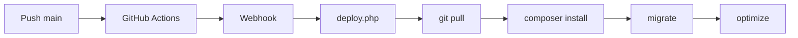

# ?? Hotel PMS � Tutorial & Dokumentasi

**Versi:** 2.3 | **Update:** Juli 2026 | **Stack:** Laravel 13 / PHP 8.3 / MySQL / Blade + Tailwind

---

## ?? Daftar Isi
1. [Pendahuluan & Prasyarat](#-pendahuluan)
2. [Login & Test Credentials](#-login)
3. [Learning Path](#-learning-path)
4. [Navigasi Menu](#-navigasi-menu)
5. [Quick Start � Instalasi](#-quick-start)
6. [Fitur Step-by-Step](#-fitur-lengkap)
7. [Permission & Role](#-permission--role)
8. [Model, API & Struktur Project](#-model--api--struktur)
9. [Troubleshooting](#-troubleshooting)
10. [Glossary](#-glossary)
11. [Latihan Mandiri](#-latihan-mandiri)
12. [Deployment & Support](#-deployment--support)

---

## ?? Pendahuluan

**Hotel PMS** � Aplikasi manajemen hotel berbasis web: reservasi, check-in/out, housekeeping, keuangan, OTA, AI Chat, & laporan.

**Prasyarat:** PHP 8.3+, Composer, Node.js/NPM, MySQL, Git, Web Browser.  
?? Pakai Laragon? Semua sudah include � download di [laragon.org](https://laragon.org).

---

## ?? Login

| Username | Password | Role | Akses |
|----------|----------|------|-------|
| `owner` | `password` | Owner | **Semua fitur** + admin panel |
| `admin` | `password` | Admin | Semua kecuali settings sensitif |
| `frontoffice` | `password` | Front Office | Reservasi, check-in/out, HK, transaksi |

**Cara:** Buka `http://localhost:8000` ? Login ? isi username/password ? **Login**.

> ?? **Latihan 1:** Login dengan 3 akun, amati perbedaan menu!

---

## ??? Learning Path

| Level | Waktu | Topik |
|-------|-------|-------|
| ?? **Pemula** | 1-2 jam | Login, Dashboard, Kamar, Reservasi Dasar, Check-in/out |
| ?? **Menengah** | 3-5 jam | Pembayaran, Housekeeping, Laporan, Service Charge, Expense |
| ?? **Mahir** | 5-8 jam | OTA, Night Audit, Promo Pricing, AI Chat, Reports Export |
| ? **Expert** | 8+ jam | API, Role & Permission, Backup, Deployment, Troubleshooting |

---

## ?? Navigasi Menu

```
?? Sidebar
+-- ?? Front Desk       ? Reservasi, Check-In/Out, Pindah Kamar, Issue Card MHS
+-- ?? Housekeeping     ? Tasks, Checklists, Inventory, Lost & Found
+-- ?? Keuangan         ? Transaksi, Deposit, Service Charge, Expense, Pendapatan Resto
+-- ?? Laporan          ? Reports (Okupansi, Revenue, Reservations, Guest List, Group)
+-- ?? Allotment        ? Atur kuota kamar untuk website/API
+-- ?? Promo Pricing    ? Diskon harga per tipe kamar
+-- ?? API Keys         ? Generate & kelola API Key untuk integrasi
+-- ?? Admin            ? Users, Roles, OTA Log, Hotel Settings, Night Audit, Backups
```

> Menu tergantung **Role** Anda. Login sebagai `owner` untuk akses penuh.

---

## ?? Quick Start

```bash
# 1. Clone & install
git clone https://github.com/imamw95-crb/hotel-pms.git && cd hotel-pms
composer install && npm install

# 2. Setup env
cp .env.example .env
php artisan key:generate

# 3. Setup DB (edit .env: DB_DATABASE=hotel_pms, DB_USERNAME=root, DB_PASSWORD=)
php artisan migrate && php artisan db:seed

# 4. Jalankan (2 terminal)
php artisan serve    # Terminal 1
npm run dev          # Terminal 2
```

Buka `http://localhost:8000` � login `owner` / `password`.

**Konfigurasi Tambahan (.env):**
```env
OPENROUTER_API_KEY=sk-or-v1-xxx       # AI Chat
IMAP_HOST=imap.hostinger.com          # OTA Email
IMAP_USERNAME=info@theicon.id
DEPLOY_SECRET=xxx
MHS_BRIDGE_URL=http://100.98.230.92/bridge_api.php
```

---

## ?? Fitur Lengkap

### 1. ?? Dashboard
Statistik real-time: total kamar, check-in/out hari ini, pendapatan, reservasi aktif, notifikasi.

> ?? **Latihan 2:** Login sebagai `owner`, catat jumlah kamar occupied hari ini.

---

### 2. ??? Reservasi

**Buat Reservasi:** Reservasi ? + Tambah ? Pilih tipe kamar ? Pilih kamar (hijau = available) ? Isi data tamu ? Tentukan tanggal (CI: 14:00, CO: 12:00) ? Harga ? Pembayaran ? **Simpan**.

**Check-In:** Cari reservasi ? Verifikasi data & bayaran ? Klik **Check-In** ? (Opsional) Issue card MHS ? Status kamar ? `occupied`.

**Check-Out:** Buka reservasi ? Hitung tagihan + service charge ? Bayar final ? Return deposit ? Klik **Check-Out** ? Kamar ? `cleaning`, tugas HK otomatis.

> ?? **Back-to-back:** Check-out 12:00 & check-in 14:00 di kamar sama = **BUKAN konflik**.
> ?? **Latihan 3:** Buat reservasi ? check-in ? check-out. Amati perubahan status kamar.

---

### 3. ?? Housekeeping

**Akses:** Front Desk ? Housekeeping.

**Buat Tugas:** Buat Tugas ? Pilih kamar ? Tipe (`cleaning`/`deep_clean`/`maintenance`/`inspection`/`turndown`) ? Prioritas (`low`/`normal`/`high`/`urgent`) ? Deskripsi ? Assign staff ? **Simpan**.

**Bulk Create:** Buat tugas untuk banyak kamar sekaligus.

**Assign:** Manual (??) atau Auto-Assign (?) � otomatis ke staff dengan beban paling ringan.

**Kerjakan:** ?? (Mulai) ? timer berjalan ? ? (Selesai) ? upload foto, isi checklist ? durasi tercatat.

**Detail Tugas:** ??? Lihat checklist, log riwayat, foto, durasi.

> ?? **Tips:** Filter by status/tipe/prioritas/kamar/tanggal. Tugas overdue = badge merah.
> ?? **Latihan 4:** Buat 3 tugas, assign ke staff berbeda, selesaikan 1, amati statistik.

---

### 4. ?? Transaksi & Deposit

**Pembayaran:** Transaksi ? Tambah ? Pilih tipe (Bayar/Refund) ? Pilih reservasi ? Jumlah ? Metode ? **Simpan**.

**Deposit Kartu:** Saat CI: Deposit ? Tambah ? Pilih reservasi ? Rp 100.000 (default) ? Simpan.  
Saat CO: Cari deposit ? **Return Deposit** ? Masukkan jumlah kembali.

> ?? **Latihan 5:** Buat deposit untuk reservasi check-in, lalu return deposit.

---

### 5. ?? Laporan

| Laporan | Akses | Export |
|---------|-------|--------|
| Guest List | Reports ? Guest List | CSV / Print |
| Occupancy | Reports ? Occupancy | CSV / Print |
| Revenue | Reports ? Revenue | CSV / Print |
| Reservations | Reports ? Reservations | CSV / Print |
| Group Report | Reports ? Group | CSV / Print |

> ?? **Latihan 6:** Buka Occupancy bulan ini, export CSV, buka di Excel.

---

### 6. ?? Promo Pricing

Promo ? Tambah ? Pilih tipe kamar ? Tanggal mulai/selesai ? Harga promo ? **Simpan**.  
Saat reservasi di tanggal promo, harga otomatis terpakai.

> ?? **Latihan 7:** Buat promo Deluxe diskon 20% selama 3 hari, verifikasi di reservasi.

---

### 7. ?? Lost & Found

Lost & Found ? Tambah Item ? Isi nama, kategori, deskripsi, lokasi, penemu ? **Simpan**.  
Status: `reported` ? `found` ? `returned` ? `disposed`.

> ?? **Latihan 8:** Catat "Dompet Hitam" ditemukan di kamar 102, update ke `returned`.

---

### 8. ?? Hotel Settings (Owner Only)

Admin ? Settings. Konfigurasi: nama hotel, logo, IMAP (OTA), OpenRouter key, MHS Bridge URL.

> ?? Setelah ubah IMAP, cek OTA Email Log untuk verifikasi.

---

### 9. ?? Database Backup (Owner Only)

Admin ? Backups ? **Create Backup** ? download ?? atau **Restore**.  
?? Backup **setiap hari**, simpan di **2 tempat**, backup **sebelum update besar**.

---

### 10. ?? Service Charge

Service Charge ? Tambah Biaya ? Pilih reservasi ? Deskripsi (contoh: "Minibar 2x Coca Cola") ? Rp 35.000 ? **Simpan**.  
Otomatis masuk tagihan kamar.

> ?? **Latihan 9:** Tambah service charge laundry Rp 75.000 ke reservasi check-in.

---

### 11. ??? Pendapatan Resto & 12. ?? Issue Card MHS

**Resto:** Pendapatan Resto ? Tambah ? Deskripsi, jumlah ? (Opsional) hubungkan ke tagihan kamar.

**Issue Card MHS:** Cari reservasi ? Atur jumlah kartu ? **Issue Card**. Fitur: Test Connection, Read Card, Re-Issue.

---

### 13. ?? Pindah Kamar & 14. ?? Night Audit

**Pindah Kamar:** Pilih reservasi ? Pilih kamar baru (available) ? Alasan ? **Pindahkan**.

**Night Audit:** Admin ? Night Audit ? **Preview** ? Periksa data occupied, CI/CO, pendapatan ? **Save Draft** atau **Lock**. Lakukan **setiap malam**.

---

### 15. ? Allotment System

Mengatur kuota kamar yang tampil di website publik (`theicon.id`).

**Aturan:** Hanya tipe kamar dengan allotment (`channel='api'`) yang tampil. Tipe tanpa allotment tidak tampil sama sekali.

**Cara:** Allotment ? Tambah ? Pilih tipe kamar ? Isi tanggal, jumlah kuota, harga opsional ? **Simpan**.

Alur di Website:
```
Admin set allotment ? Webhotel panggil /api/rooms/available 
? Cek allotment per tipe kamar per range tanggal
? Tampilkan min(allotment - booked) kamar
```

> ?? Harga efektif: harga allotment (jika di-set) ? fallback ke harga master kamar.
> ?? **Latihan 11:** Set allotment 5 kamar Deluxe untuk 7 hari ke depan, verifikasi di website.

#### ?? Cek "Allotment Ada Tidak" (Logika Inti)

Saat website memanggil `GET /api/rooms/available`, sistem **wajib** mengecek apakah tipe kamar punya allotment di range tanggal yang diminta. Inilah inti aturan "ada tidak":

**1. Query allotment per tipe kamar + range tanggal**
```php
$allotments = Allotment::where('room_type_id', $roomTypeId)
    ->where('date', '>=', $checkInDate)
    ->where('date', '<',  $checkOutDate)   // eksklusif check-out
    ->where(function ($q) {
        $q->where('channel', 'api')        // hanya channel api yg tampil di web
          ->orWhereNull('channel');        // atau yg belum di-set channel
    })
    ->orderBy('date')
    ->get();
```

**2. Keputusan "Ada" vs "Tidak Ada"**
| Kondisi | Hasil | Tindakan |
|---------|-------|----------|
| `$allotments->isEmpty()` | **TIDAK ADA** allotment | Tipe kamar **tidak tampil sama sekali** (`return collect()`) |
| `$allotments` terisi | **ADA** allotment | Lanjut hitung sisa kuota |

```php
if ($allotments->isEmpty()) {
    // Tidak ada allotment = jangan tampilkan tipe ini
    return collect();
}
```

**3. Hitung sisa kuota minimal (jika ADA)**
```php
$minAvailable = $allotments->min(fn($a) => $a->allotment - $a->booked);
$limit = max(0, (int) $minAvailable);   // jangan negatif
```
Tipe kamar hanya menampilkan `$limit` kamar = nilai terkecil dari `(allotment - booked)` di seluruh tanggal menginap.

**4. Helper `Allotment::isAvailable()`**
Model `Allotment` juga punya method cepat untuk cek 1 tanggal:
```php
Allotment::isAvailable($roomTypeId, $date, 'api'); // true = masih sisa
```
- Return `true` jika **tidak ada baris allotment** (dianggap unlimited).
- Return `true`/`false` berdasarkan `booked < allotment` jika baris ada.

> ?? **Ringkas:** Tidak ada allotment ? tipe kamar **hilang** dari website. Ada allotment ? tampil `min(allotment - booked)` kamar. Method `limitAvailablePerType()` **sudah tidak dipakai**.

> ?? **Latihan 11b:** Hapus allotment sebuah tipe kamar ? panggil `/api/rooms/available` ? pastikan tipe tersebut tidak muncul. Lalu buat allotment 3 kamar ? pastikan hanya 3 yang tampil.

---

### 16. 📧 OTA Integration

OTA Email Log: Lihat email dari Tiket.com/Traveloka ? ? Success / ? Pending / ? Failed ? Klik detail ? **Retry** jika gagal.

Pastikan IMAP dikonfigurasi di **Hotel Settings**.

> ?? **Latihan 12:** Cek OTA Email Log, retry email yang gagal.

---

### 17. ?? AI Chat Assistant

Klik ?? di pojok kanan bawah ? Ketik dalam Bahasa Indonesia, contoh:  
- *"Cari kamar deluxe tersedia 3 malam mulai besok"*  
- *"Booking deluxe 102 untuk 2 malam atas nama Budi Santoso"*

AI bisa auto-create reservasi. Pastikan `OPENROUTER_API_KEY` terisi.

---

### 18. ?? MCP Server (AI Integration)

MCP (Model Context Protocol) server terintegrasi untuk menyediakan tools AI ke aplikasi eksternal.

**Resources Tersedia:** `hotel://reservations`, `hotel://rooms`, `hotel://guests`, `hotel://stats`

**Tools Tersedia:** `create-reservation`, `search-reservations`, `get-room-availability`, `get-hotel-stats`

---

### 19. ?? API Key Management

Admin ? API Keys ? **Generate Key** ? Simpan key (hanya muncul sekali).

**Gunakan API Key:**
```bash
# Via header
curl -H "X-API-Key: hms_xxx" http://localhost:8000/api/stats

# Via query parameter
curl "http://localhost:8000/api/stats?api_key=hms_xxx"
```

> ?? **Latihan 13:** Generate API Key, gunakan untuk akses endpoint `/api/stats`.

---

### 20. ??? Out of Order

Menandai kamar yang tidak bisa dioperasikan (renovasi, rusak, dll).

**Cara:** Out of Order ? Tambah ? Pilih kamar ? Tanggal mulai & selesai ? Alasan ? **Simpan**.

Kamar OOO tidak akan muncul di pencarian kamar tersedia.

---

### 21. ?? Housekeeping Checklist & Inventory

**Checklist:** Setiap tugas HK memiliki daftar periksa yang harus diisi saat eksekusi. Staff centang item checklist saat mengerjakan tugas.

**Inventory:** Catat stok perlengkapan kamar (handuk, linen, amenities, dll). Inventory ? Tambah item ? Nama, jumlah, satuan ? **Simpan**.

---

### 22. ?? Expense & Refund

**Expense:** Catat pengeluaran hotel (listrik, gaji, maintenance, dll). Admin ? Expense ? Tambah ? Deskripsi, jumlah, kategori, tanggal ? **Simpan**.

**Refund:** Admin ? Transaksi ? Tambah ? Pilih tipe `Refund` ? Pilih reservasi ? Jumlah ? **Simpan**. Otomatis mengurangi `paid_amount`.

---

### 23. ?? OTA Payment Status

Booking dari OTA memiliki status pembayaran terpisah:
| Status | Arti |
|--------|------|
| `paid_ota` | Sudah dibayar OTA |
| `partial_ota` | Dibayar sebagian oleh OTA |
| `unpaid_ota` | Belum dibayar OTA |

Saat tambah pembayaran, jumlah OTA + hotel bisa diisi terpisah.

---

## ?? Permission & Role

| Role | Level | Akses |
|------|-------|-------|
| `owner` | ????? | Semua fitur |
| `admin` | ???? | Semua kecuali settings sensitif |
| `frontoffice` | ??? | Operasional harian |
| `user_manager` | ??? | Kelola user (tanpa admin panel) |

**Kelola User:** Admin ? Users ? Tambah/Edit ? Atur Role.  
**Kelola Permission:** Admin ? Roles ? Edit Permission ? Centang ? Simpan.

```blade
@if(hasPermission('view_reports')) ... @endif
@if(hasAllPermissions(['view_reports','export_reports'])) ... @endif
@if(hasAnyPermission(['manage_users','manage_rooms'])) ... @endif
```

```php
// Middleware
Route::get('/reports', ...)->middleware('permission:view_reports');
Route::group(['middleware' => ['role:owner']], function () { ... });
```

> ?? **Latihan 14:** Login owner ? Admin ? Roles ? edit permission frontoffice, lalu cek perubahannya.

---

## ?? Model, API & Struktur

### Core Models

| Model | Tabel | Relasi |
|-------|-------|--------|
| Room | rooms | ? RoomType, hasMany Reservation |
| RoomType | room_types | hasMany Room, hasMany RoomTypeDatePrice |
| Allotment | allotments | ? RoomType |
| Reservation | reservations | ? Room, Guest, User |
| Guest | guests | hasMany Reservation |
| Transaction | transactions | ? Reservation, PaymentMethod |
| User | users | ? Role |
| Role | roles | hasMany User, belongsToMany Permission |
| Permission | permissions | belongsToMany Role |
| HousekeepingTask | housekeeping_tasks | ? Room, User |
| HousekeepingTaskChecklist | housekeeping_task_checklists | ? HousekeepingTask |
| HousekeepingInventory | housekeeping_inventories | - |
| Deposit | deposits | ? Reservation |
| ServiceCharge | service_charges | ? Reservation |
| Expense | expenses | - |
| RestoTransaction | resto_transactions | ? Reservation (opsional) |
| OutOfOrder | out_of_orders | ? Room |
| BookingNotification | booking_notifications | morphTo |
| NightAuditLog | night_audit_logs | - |
| LostFound | lost_founds | ? Reservation (opsional) |
| HotelSetting | hotel_settings | - |
| PaymentMethod | payment_methods | hasMany Transaction |

### Business Logic Penting
- **Check-in:** 14:00 | **Check-out:** 12:00
- **Back-to-back:** CI 14:00 setelah CO 12:00 di kamar sama = ? **AMAN**
- **Overlap query:** `where('check_in', '<', $checkOut)->where('check_out', '>', $checkIn)`
- **Room status:** `available` ?? ? `occupied` ?? ? `cleaning` ?? ? `maintenance` ?
- **Reservation status:** `pending` ? `checked_in` ? `checked_out` / `cancelled`

### Services

| Service | Fungsi |
|---------|--------|
| ReservationService | Logika bisnis reservasi (create, cancel) + DB locking |
| AiChatService / OpenRouterService | AI Chat |
| AvailabilityService | Cek ketersediaan kamar |
| BookingSyncService / ImapService / EmailParserService / BookingMapperService | OTA Integration |
| MHSBridgeService | Issue card MHS |
| HousekeepingService | Logika housekeeping (auto-assign, timer) |

### API Endpoints (Auth: `X-API-Key`)

| Method | Endpoint | Fungsi |
|--------|----------|--------|
| GET | `/api/reservations` | Daftar reservasi (filter: search, status, date) |
| GET | `/api/reservations/{id}` | Detail reservasi + transaksi |
| POST | `/api/reservations` | Buat reservasi |
| PUT | `/api/reservations/{id}` | Update reservasi |
| POST | `/api/reservations/{id}/cancel` | Batalkan reservasi |
| POST | `/api/reservations/{id}/checkin` | Check-in |
| POST | `/api/reservations/{id}/checkout` | Check-out |
| POST | `/api/reservations/{id}/change-room` | Pindah kamar |
| POST | `/api/reservations/{id}/payments` | Tambah pembayaran |
| PATCH | `/api/reservations/{id}/total` | Update total amount |
| PATCH | `/api/reservations/{id}/room-rate` | Update harga kamar |
| GET | `/api/reservations/checked-in` | Daftar reservasi check-in |
| GET | `/api/rooms` | Daftar kamar |
| GET | `/api/rooms/available` | Kamar tersedia (dengan allotment) |
| GET | `/api/guests` | Daftar tamu |
| GET | `/api/stats` | Statistik dashboard |
| GET/POST | `/api/promo-prices` | Promo pricing |
| GET | `/api/promo-prices/check` | Cek harga promo |
| GET | `/api/room-types/prices` | Harga per tipe kamar |
| GET/POST/PUT/DELETE | `/api/allotments` | CRUD allotment |
| GET | `/api/allotments/check` | Cek ketersediaan allotment |
| GET | `/api/allotments/summary` | Ringkasan allotment |
| POST | `/api/ai/chat` | AI Chat |
| POST | `/api/v1/api-keys` | Generate API Key |
| GET | `/api/v1/api-keys` | List API Keys |

### Struktur Project

```
hotel-pms/
+-- app/          ? Models, Services, Http/Controllers, Jobs, Providers
+-- config/       ? app.php, menus.php, services.php
+-- database/     ? migrations/, factories/, seeders/
+-- resources/    ? views/ (Blade), css/, js/
+-- routes/       ? web.php, api.php, console.php
+-- storage/      ? app/, logs/, framework/
+-- tests/        ? Feature/, Unit/
+-- public/       ? index.php, assets/, build/
```

---

## ?? Troubleshooting

| # | Masalah | Solusi |
|---|---------|--------|
| 1 | **Halaman putih/500** | `php artisan cache:clear` + `php artisan config:clear` |
| 2 | **Login gagal** | Reset password di DB |
| 3 | **AI tidak merespon** | Cek `OPENROUTER_API_KEY` di .env |
| 4 | **Email OTA tidak masuk** | Cek IMAP di Hotel Settings |
| 5 | **Permission denied** | `php artisan cache:clear` |
| 6 | **Kamar tidak muncul** | `php artisan db:seed --class=RoomSeeder` |
| 7 | **Menu tidak lengkap** | Login sebagai `owner` |
| 8 | **Chart tidak tampil** | `npm run build` atau refresh |

**Common Mistakes:**
- ? Lupa `migrate` ? data tidak muncul
- ? Salah paham back-to-back ? dianggap konflik padahal aman
- ? Tidak pakai `with()` ? N+1 query (lambat)
- ? Lupa filter status `cancelled` di query
- ? Tidak backup sebelum migrasi ? data hilang

**Debugging flow:** Error ? Cek `storage/logs/laravel.log` ? SQL error? ? `migrate:fresh --seed` | PHP error? ? `composer update` | JS error? ? F12 console ? Refresh & clear cache.

---

## ?? Glossary

| Istilah | Arti |
|---------|------|
| **OTA** | Online Travel Agent (Tiket.com, Traveloka) |
| **PMS** | Property Management System |
| **Back-to-back** | Tamu baru check-in di hari tamu lama check-out |
| **Night Audit** | Penutupan akhir hari |
| **MHS** | Magic Hotel System (pembuat kartu kamar) |
| **IMAP** | Protokol baca email |
| **OpenRouter** | Gateway API untuk AI (LLM) |
| **Eloquent** | ORM Laravel |
| **Blade** | Template engine Laravel |
| **Eager Loading** | Load relasi DB sekaligus (`with()`) |

---

## ?? Latihan Mandiri

### ?? Pemula
**A.** Login `frontoffice` ? buat reservasi "Siti Rahma" Deluxe ? check-in ? service charge Rp 50.000 ? check-out ? verifikasi kamar jadi `cleaning`.  
**B.** Login `owner` ? buka semua menu, catat fiturnya. Bandingkan dengan login `frontoffice`.

### ?? Menengah
**C.** Bulk create 5 tugas cleaning ? assign 2 ke staff A, 3 ke staff B ? selesaikan 3 tugas ? cek workload & chart.  
**D.** Buka Occupancy Report bulan ini ? filter Deluxe ? export CSV ? buka di Excel.

### ?? Mahir
**E.** Buat promo Standard Room diskon 25% (besok-3hari) ? reservasi di tanggal promo (harga promo) & di luar (harga normal).  
**F.** Login owner ? buat user `frontoffice` baru ? login sbg user itu ? catat menu ? edit permission-nya ? refresh.

### ? Expert
**G.** Dapatkan API Key ? coba `curl -H "X-API-Key: key" http://localhost:8000/api/rooms` ? buat reservasi via API.  
**H.** `php artisan cache:clear` ? hapus isi `storage/logs/` ? akses URL salah ? cek log ? identifikasi error.

---

## ?? Deployment & Support

### Deployment


**Setup:** Generate secret (`php -r "echo bin2hex(random_bytes(32));"`) ? Set `DEPLOY_SECRET` & `DEPLOY_URL` di .env & GitHub Secrets ? Konfigurasi webhook (URL: `https://domain.com/deploy.php`, events: Push main).

### Support
1. Baca **Troubleshooting** di atas
2. Cek `storage/logs/laravel.log`
3. Buka **GitHub Issues**
4. `php artisan db:monitor` untuk debug query

---

> **?? Tip:** Praktek adalah cara terbaik belajar. Kerjakan latihan A?H berurutan. Selamat belajar! ??